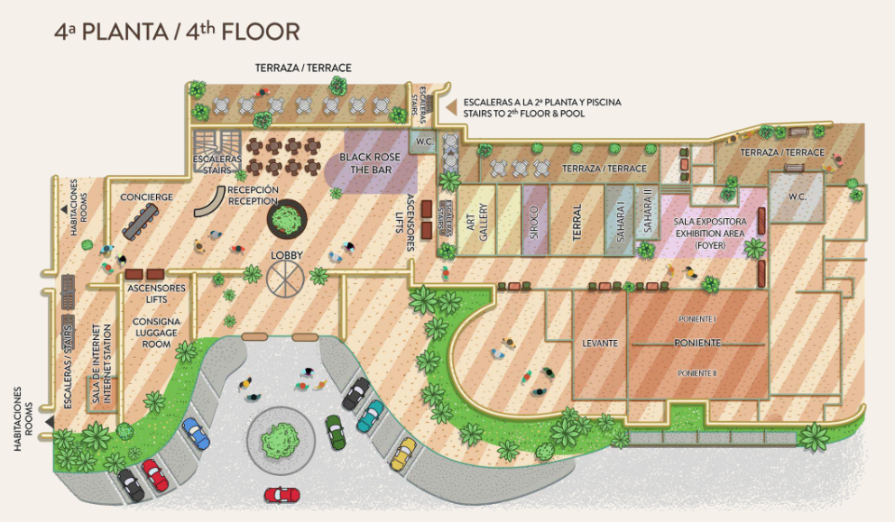
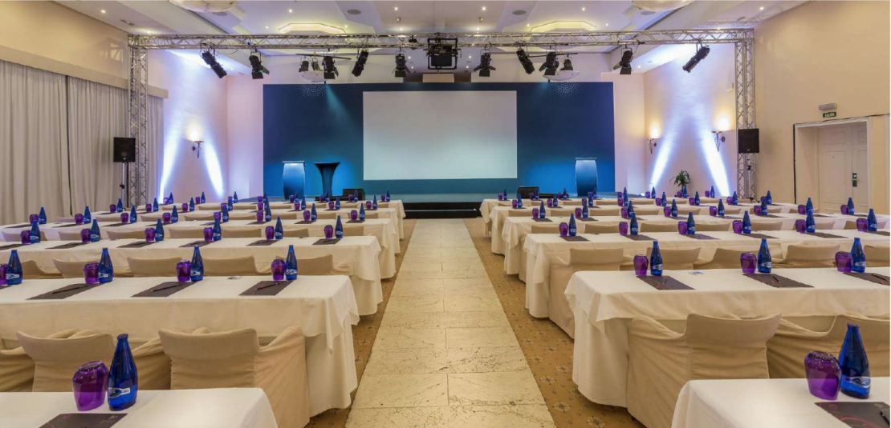
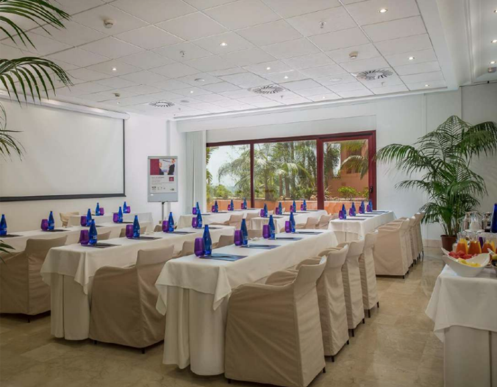

<script> 
    $(document).ready(function() { 
    $head = $('#header'); 
    $head.prepend('<A href = https://www.cuttingedge-events.com></A>') 
    }); 
</script> 


```{r setup, include=FALSE}
knitr::opts_chunk$set(echo = FALSE, message=FALSE, warning=FALSE)
```


```{r libraries}
library(readxl)
library(shiny)
library(dplyr)
library(knitr)
library(timevis)

```

<br>

# Malaga-Costa del Sol

Magala's Aiport has a lot of direct flight connections. 
Costa del Sol offers very good weather and very nice hotels with wonderful seaviews.

<iframe src="https://www.google.com/maps/d/embed?mid=1Dsd3LKRpe1SLWuvR3eiYDv4sDU7Ryjv6&hl=es" width="100%" height="550"></iframe>

For Audika we would suggest two options: Kempinski (75km from the Airport) and H10 Andalucia Plaza (60km from the Airport)
Both hotels are very good hotels with meeting facilities suitable to host a meeting for 125 pax in cabaret style.

As you can see on the map there are a lot of restaurant and venue options suitable for the group in this area.

<br>

##  Suggested Hotels {.tabset .tabset-fade .tabset-pills}

### LOS MONTEROS HOTEL & SPA

<iframe src="LOS MONTEROS/LosMonteros.html"  frameborder="0" width="100%" height="1200" scrolling="no"></iframe>

<br>

 **AUDIKA GROUP ACCOMMODATION**

The hotel has 173 rooms in total, Audika would have 125 similar rooms.


<br>

 **MEETING FACILITIES**

* **Plenary room** *Salon Real*  Capacity in cabaret style for 150pax. Features natural sunlight.


<br>


* **Breakout room** *Patio 1 + 2* capacity for 50 pax in theater setup and daylight


<br>

**DINNERS**

Los Monteros Marbella has different options for the welcome and Gala dinners

For the welcome drink we would suggest the Sunset Terrace


<br>
 
Flamingo restaurant is where the breakfast and buffet lunch will be served.


<br>

For the Gala dinner we suggest the most special place: La cabane


<br>

<iframe width="100%" height="500" src="https://www.youtube.com/embed/dRFCet_tPkw" frameborder="0" allow="accelerometer; autoplay; encrypted-media; gyroscope; picture-in-picture" allowfullscreen></iframe>
<br>


### KEMPINSKI

<iframe src="KEMPINSKI/Kempinski.html"  frameborder="0" width="100%" height="1200" scrolling="no"></iframe>

<br>

 **AUDIKA GROUP ACCOMMODATION**

The hotel has 128 rooms with 40-45m2 each plus 17 suites.

Audika would have 125 rooms, all of them with similar size but not all with the same views or decoration.


<br>


<br>


 **MEETING FACILITIES**

Meeting room floor plan:

<br>



Following the request, we propose the following meeting rooms for AUDIKA meetings:

* **Plenary room** *Poniente I&II*  Capacity in cabaret style for 150pax. Features natural sunlight.



<br>

* **Breakout room** *Levante* capacity for 50 pax and daylight




<br>

<br>

**DINNERS**

Kempinski Hotel has different options for the welcome and Gala dinners


<br>


<br>


<br>
<hr>

### H10 ANDALUCIA PLAZA

<iframe src="H10 ANDALUCIA PLAZA/H10AndaluciaPalza.html"  frameborder="0" width="100%" height="1300" scrolling="no"></iframe>

<br>

 **AUDIKA GROUP ACCOMMODATION**

The hotel has 400 rooms in total.

Audika would have 125 rooms with the same level.


<br>


<br>

 **MEETING FACILITIES**

Following the request, we propose the following meeting rooms for AUDIKA meetings:

* **Plenary room** *Castilla A+B+C*  500m2 Capacity in cabaret style for 150pax. Features natural sunlight.

<br>


* **Breakout room** *Málaga* capacity for 50 pax and daylight

<br>


<br>

**DINNERS**

The Hotel has different options for the welcome and Gala dinners


<br>


<br>


## Budget {.tabset .tabset-fade .tabset-pills}

### Los Monteros


<iframe src="https://audikalosmonterosbudget.netlify.com"  frameborder="0" width="100%" height="800" scrolling="no"></iframe>
<hr>


### Kempinski Budget


<iframe src="https://audikakempinskibudget.netlify.com/"  frameborder="0" width="100%" height="800" scrolling="no"></iframe>
<hr>

### H10 Andalucia Plaza Budget


<iframe src="https://audikah10budget.netlify.com"  frameborder="0" width="100%" height="800" scrolling="no"></iframe>
<hr>


# Terms and conditions

  * Rates valid for 2020
  
  * For a group of minimum 115 pax.
  
  * Cutting Edge Events management fee including in the detailed rates
  
  * VAT included. 
  
  * No reservation has been done. Availability upon request.
  
*****


